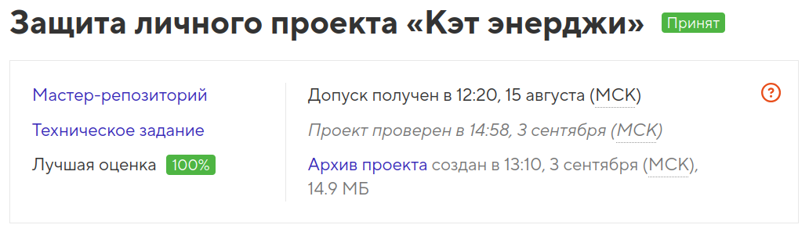

# Учебный проект «Кэт энерджи»

Репозиторий создан для обучения на профессиональном онлайн‑курсе «[HTML и CSS. Адаптивная вёрстка и автоматизация](https://htmlacademy.ru/intensive/adaptive)» от [HTML Academy](https://htmlacademy.ru).

<h4>Курс пройден в 2024 году</h4>

  

* Студент: [Виктория Калугина](https://up.htmlacademy.ru/adaptive-individual/1/user/1788421).
* Наставник: [Александр Зиновьев](https://htmlacademy.ru/profile/id198751)

* Проект: [Кэт энерджи](https://toryatoria.github.io/1788421-cat-energy-1/)

---

## Описание

**«Кэт энерджи»** — это учебный проект интернет-магазина функционального питания для котов.

В рамках проекта свёрстаны:
  -  Главная страница (index.html),
  -  Страница каталога (catalog.html).
  -  Страница с формой подбора программы (form.html).

Проект адаптирован под мобильное, планшетное и десктопное разрешения экрана.
Между версиями сетка может быть как резиновой, так и фиксированной.

### Основная цель — показать умение применять на практике навыков:

* Семантическая и валидная верстка
* Методология БЭМ
* Препроцессор Sass
* Адаптивная и резиновая верстка
* Растровая графика: ретинизация, формат WebP
* Векторная графика: SVG-спрайт (иконки и декоративные элементы)
* Кроссбраузерность
* Подход к разработке: Mobile First
* Выравнивание по макету в PixelPerfect
* Работа с ускорением производительности верстки (оптимизация шрифтов, LightHouse, Google PageSpeed)
* Сборка Gulp
* Вспомогательные инструменты Node.js и npm
* Работа с Git

---

### Критерии качества

Подготовка и проверка проектов проводится по базовым и дополнительным критериям.

Базовые критерии охватывают наиболее важные требования к проекту и проверяют основные знания и навыки.

Дополнительные критерии проверяют внимателеность к деталям, и оценивают проект с точки зрения шлифовки его качества и оптимизации.

Во время финальной защиты баллы за выполнение дополнительных критериев добавляются только при выполнении всех базовых.

---

## Благодарности

  -  Команде HTML Academy за материалы и консультации.
  -  Наставнику за поддержку и советы.

---

#### Буду рада любым отзывам и Pull Request!
